# Linux Server Hardening — Defensive Posture Reinforcement

> Systematic hardening of a Debian 12 server using CIS Benchmark (debian-cis) and Lynis, with documented before/after states for 10 prioritized remediations.

---

## Table of Contents

1. [Audit Tools](#audit-tools)
2. [Initial Audit Results](#initial-audit-results)
3. [Problem Categories](#problem-categories)
4. [10 Priority Remediations](#10-priority-remediations)
5. [Remediations Applied](#remediations-applied)
6. [Post-Remediation Audit](#post-remediation-audit)
7. [Remaining Issues](#remaining-issues)
8. [Security Roadmap](#security-roadmap)

---

## Audit Tools

### Lynis

Open-source security auditing tool by CISOfy — 400+ checks, Hardening Index 0–100.

```bash
./lynis audit system
```

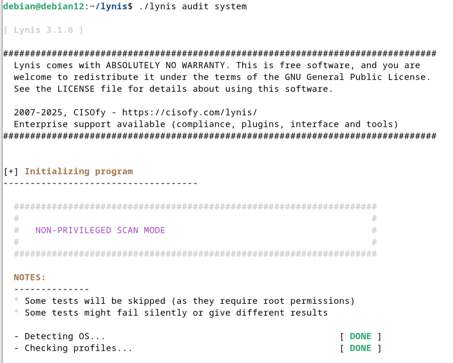

### Debian CIS Benchmark

Open-source implementation of CIS controls for Debian. Audit mode only reads, apply mode remediates.

```bash
sudo ./bin/hardening.sh --audit --allow-unsupported-distribution
```

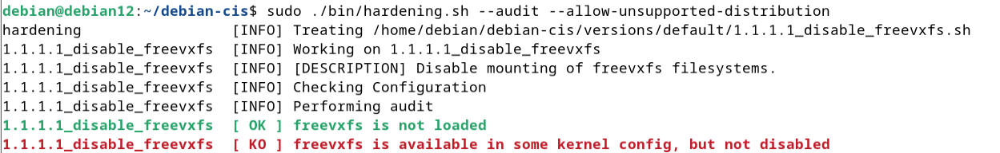

---

## Initial Audit Results

| Tool | Metric | Score |
|------|--------|-------|
| **Debian CIS** | Conformity Percentage | **46.09%** |
| **Lynis** | Hardening Index | **64 / 100** |

CIS detail: **112 / 243 checks passed** — 131 failing.

**Lynis initial scan:**
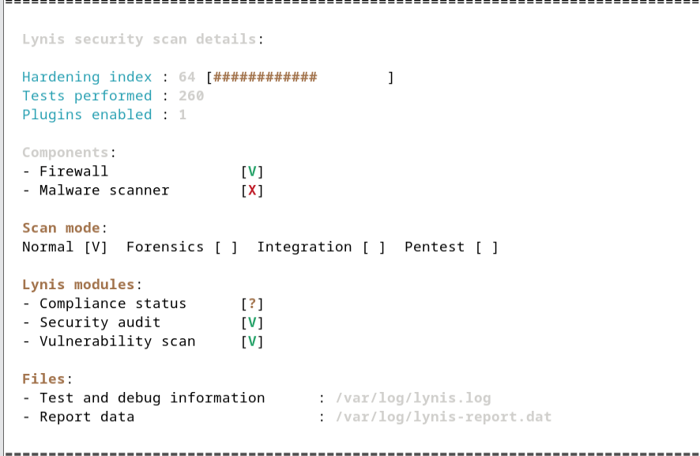

**CIS initial summary:**
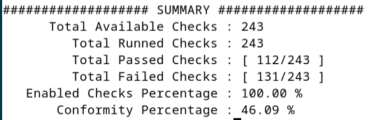

---

## Problem Categories

### 1. Critical Partition Configuration (CIS Section 1.1)

`/tmp` is not mounted with `nosuid` — binaries in `/tmp` can elevate privileges.

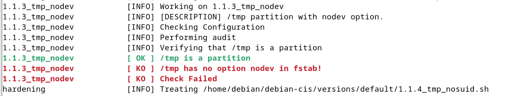

### 2. Unnecessary Services (CIS Section 2.2)

X Window System, Avahi, CUPS installed on a headless server — unnecessary attack surface.

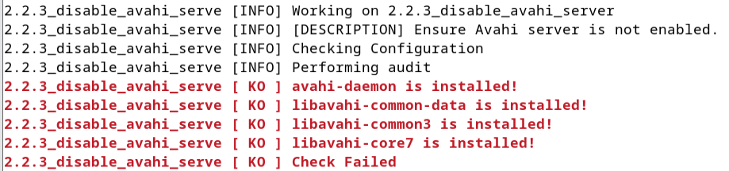

### 3. Missing Audit Infrastructure (CIS Section 4)

`auditd` is not installed — no traceability, forensic investigation impossible.

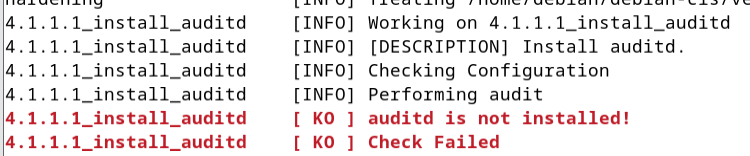

### 4. Incomplete SSH Hardening (CIS Section 5.2)

Cryptographic parameters and idle timeout not configured — vulnerable to brute-force and weak ciphers.

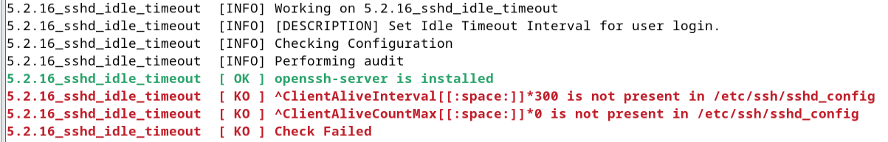

---

## 10 Priority Remediations

| # | Remediation | Risk | Priority |
|---|-------------|------|---------|
| 1 | Install auditd | No forensics without it | 🔴 Critical |
| 2 | /tmp nosuid | Local privilege escalation | 🔴 Critical |
| 3 | SSH config permissions | SSH backdoor risk | 🔴 Critical |
| 4 | Disable X Window | Unnecessary attack surface | 🟠 High |
| 5 | Disable IPv6 | Firewall bypass risk | 🟠 High |
| 6 | Password complexity (pwquality) | Weak credential exploitation | 🟠 High |
| 7 | GRUB password | Physical access bypass | 🔴 Critical |
| 8 | Install fail2ban | Brute-force defense | 🟠 High |
| 9 | Restrict core dumps | Sensitive data in crash files | 🟡 Medium |
| 10 | Default umask 077 | Files readable by other users | 🟡 Medium |

---

## Remediations Applied

### 1. Install and Enable `auditd`


```bash
sudo apt install auditd -y
```


```bash
sudo systemctl enable auditd
```

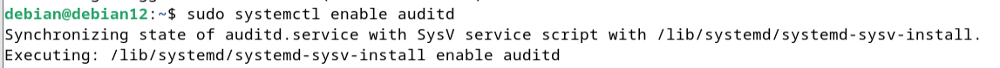

**Result — service active:**
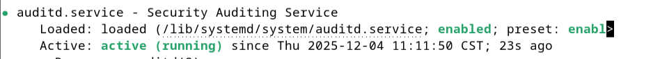

---

### 2. Restrict SUID Bit on `/tmp` (nosuid)

**Initial state — fstab without nosuid:**
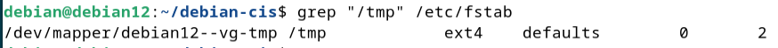

```bash
sudo sed -i '/\/tmp\s/s/defaults/defaults,nosuid/' /etc/fstab
sudo mount -o remount /tmp
```

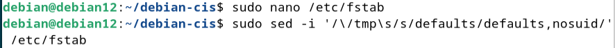

**Result — nosuid in fstab and active mount:**
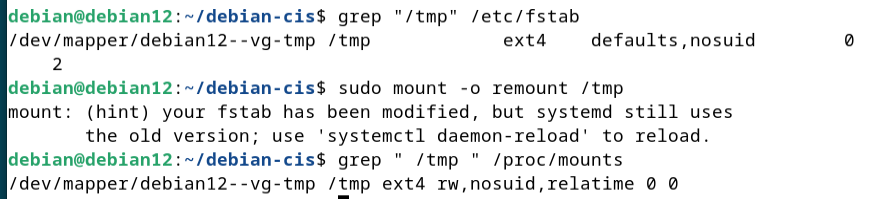

---

### 3. Fix SSH Config File Permissions

**Initial state — permissions 644 (world-readable):**
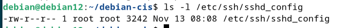

```bash
sudo chmod 600 /etc/ssh/sshd_config
```


**Result — permissions 600:**
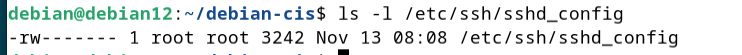

---

### 4. Remove X Window System

**Initial state — X11 packages installed:**
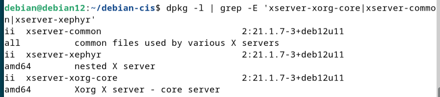

```bash
sudo apt purge xserver-xorg-core xserver-common xserver-xephyr avahi-daemon cups -y
```

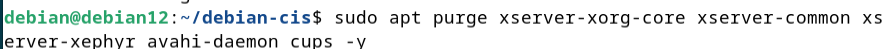

**Result — all packages removed:**
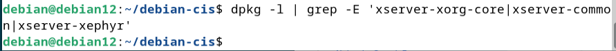

---

### 5. Disable IPv6

**Initial state — IPv6 enabled (value 0):**
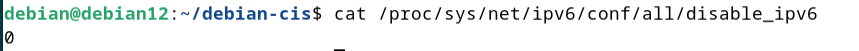

```bash
sudo tee -a /etc/sysctl.conf << EOF
net.ipv6.conf.all.disable_ipv6 = 1
net.ipv6.conf.default.disable_ipv6 = 1
net.ipv6.conf.lo.disable_ipv6 = 1
EOF
sudo sysctl -p
```

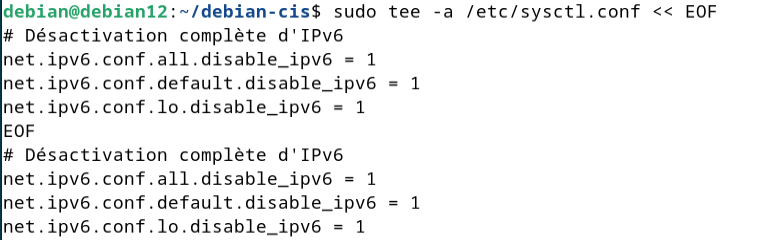

**Result — IPv6 disabled (value 1):**
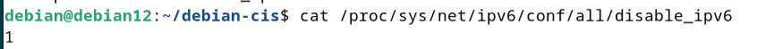

---

### 6. Enforce Password Complexity via `pwquality`

**Initial state — minimal configuration:**
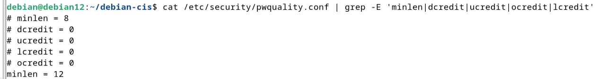

```bash
sudo nano /etc/security/pwquality.conf
```


Configuration applied — minlen=14, dcredit=-1, ucredit=-1, ocredit=-1, lcredit=-1:

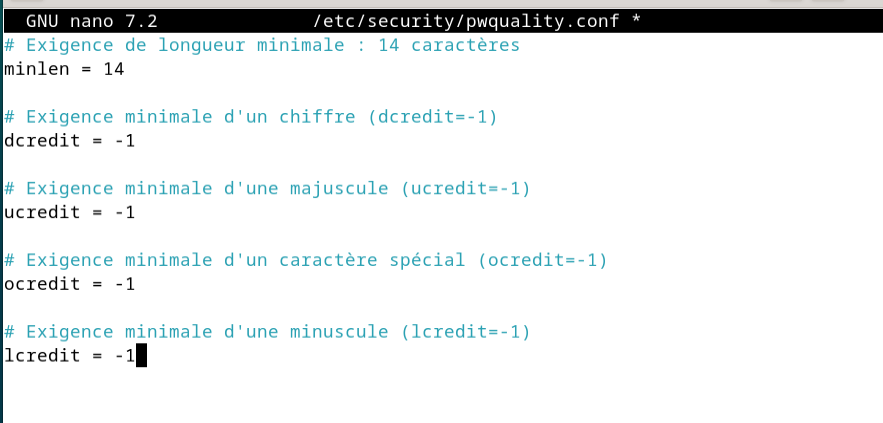

**Result — all parameters verified:**
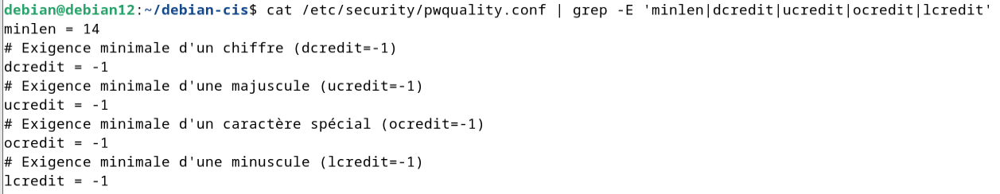

---

### 7. Protect GRUB Bootloader

```bash
sudo grub-mkpasswd-pbkdf2
```

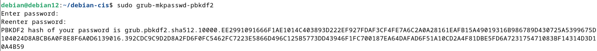

```bash
sudo tee -a /etc/grub.d/40_custom << EOF
set superusers="grubadmin"
password_pbkdf2 grubadmin <hash>
EOF
```

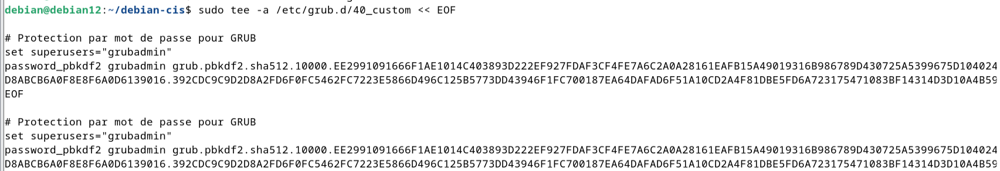

```bash
sudo update-grub
```

**Result — GRUB password protection active:**
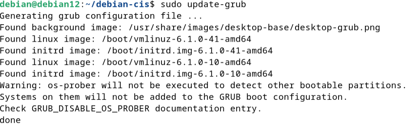

---

### 8. Install and Enable `fail2ban`

```bash
sudo apt install fail2ban -y
```


```bash
sudo systemctl enable fail2ban
```

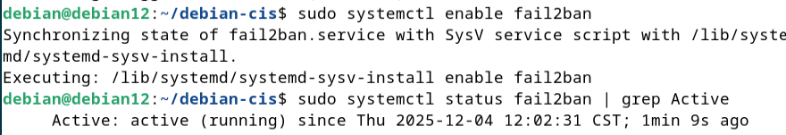

**Result — jail active for SSH:**
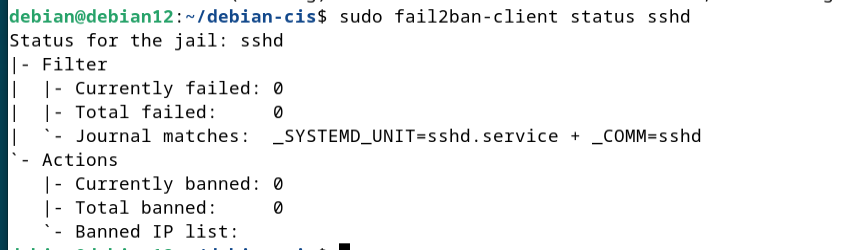

---

### 9. Restrict Core Dumps

**Initial state — no restriction in limits.conf:**
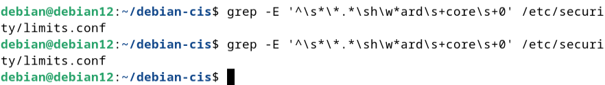

```bash
sudo tee -a /etc/security/limits.conf << EOF
* hard core 0
EOF
```

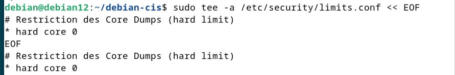

**Result:**
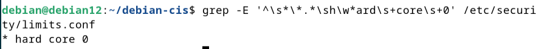

---

### 10. Set Default `umask` to 077

**Initial state — no umask in bash.bashrc:**
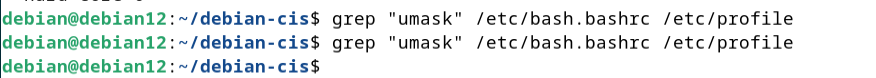

```bash
sudo tee -a /etc/bash.bashrc << EOF
umask 077
EOF
```

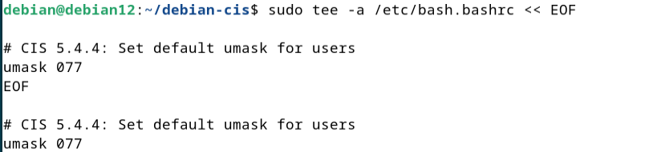

**Result — umask 077 active:**
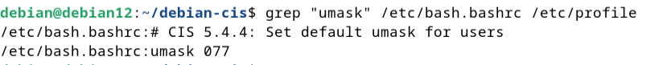

---

## Post-Remediation Audit

| Metric | Initial | Post-Remediation | Change |
|--------|---------|-----------------|--------|
| **CIS Conformity %** | 46.09% | **51.02%** | **+4.93 pts** |
| **CIS Passed Checks** | 112 / 243 | **124 / 243** | **+12 checks** |
| **Lynis Hardening Index** | 64 / 100 | **68 / 100** | **+4 pts** |

**CIS post-remediation — 51.02%:**
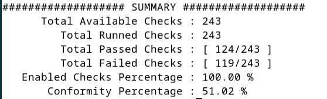

**Lynis post-remediation — score 68:**
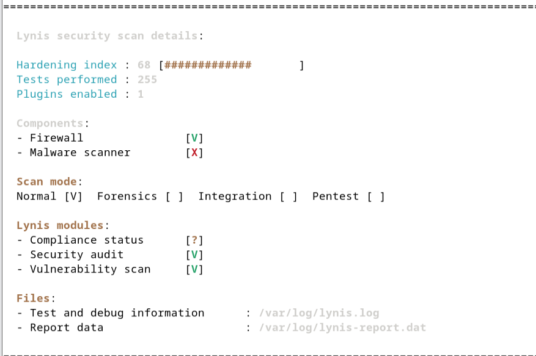

### Per-Check Confirmation

**1. auditd installed:**
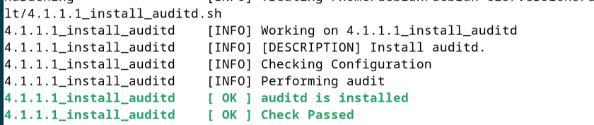

**2. /tmp nosuid:**
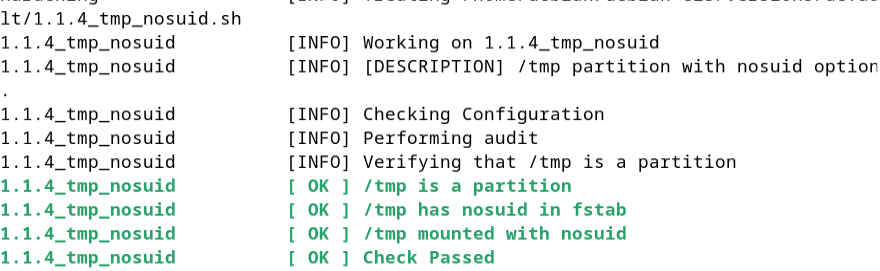

**3. SSH permissions:**
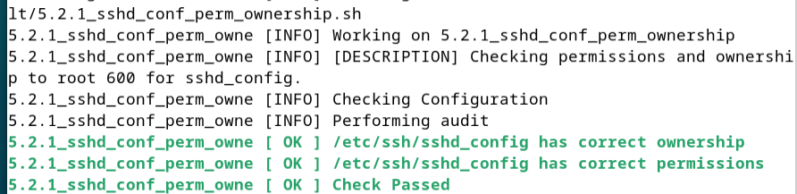

**4. X Window removed:**
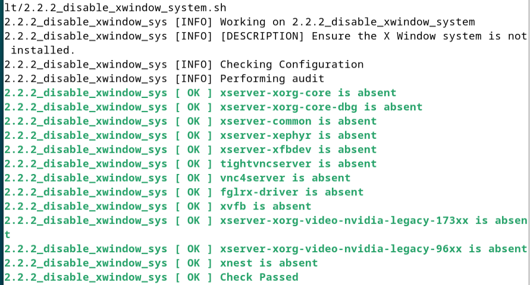

**5. IPv6 disabled:**
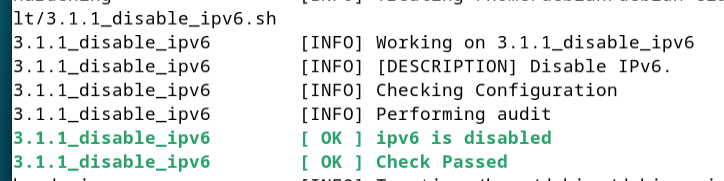

**6. pwquality configured:**
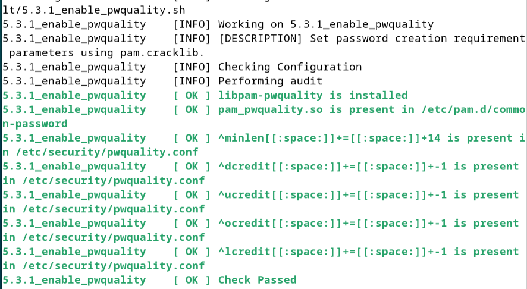

**7. GRUB protected:**
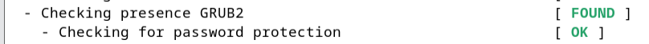

**8. fail2ban active:**


**9. Core dumps restricted:**
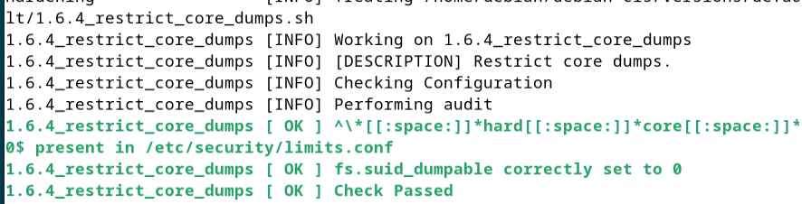

**10. umask 077:**
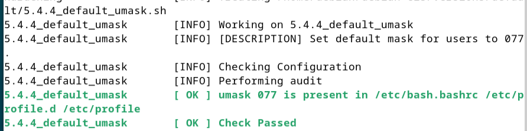

---

## Remaining Issues

| Category | Details |
|----------|---------|
| **File Integrity (FIM)** | `tripwire` / AIDE not installed — no detection of stealthy file modifications |
| **Kernel/Network** | sysctl sections 3.2–3.3 not applied (rp_filter, log_martians) |
| **PAM lockout** | `pam_faillock` not configured — fail2ban protects at network level only |
| **Permissions cleanup** | Unowned files, world-writable files, SUID/SGID review pending |

---

## Security Roadmap

```
Current:  51.02%  ████████████░░░░░░░░░░░░  Target: 85-90%
```

### Immediate (Next 30 Days)

| Action | Tool | Impact |
|--------|------|--------|
| Install AIDE (FIM) | `apt install aide && aideinit` | Detects unauthorized file changes |
| Configure pam_faillock | Edit `/etc/pam.d/common-auth` | PAM-level account lockout |
| Apply sysctl hardening | Add to `/etc/sysctl.d/99-hardening.conf` | Anti-spoofing, suspicious traffic logging |
| Clean SUID/SGID | `find / -perm /6000 -type f` | Remove unnecessary elevated binaries |

### Medium Term

| Axis | Action |
|------|--------|
| Access control | Configure AppArmor profiles for SSH |
| Centralized logging | Forward logs to SIEM |
| SSH hardening | Disable password auth, require public key only |
| Automation | Deploy Ansible playbooks for CIS controls |

### Audit Schedule

| Type | Frequency | Scope |
|------|-----------|-------|
| Light audit | Monthly | Critical checks, service status |
| Full audit | Quarterly | All 243 CIS controls |
| FIM verification | Daily (cron) | All monitored files |

---

*Author: HAMDANI Mohammed | Platform: Debian 12 (Bookworm) | Frameworks: CIS Benchmark (debian-cis) + Lynis 3.1.6*
